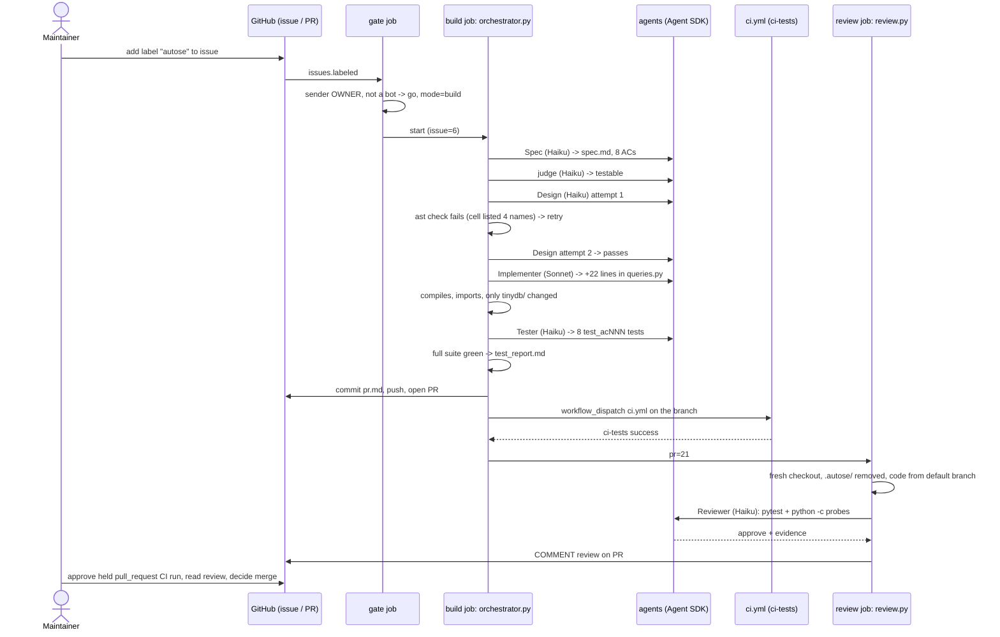

# Sequence view (real run: run 4, issue #6 `between`, Actions run 45410320210)

```mermaid
sequenceDiagram
  actor M as Maintainer
  participant GH as GitHub (issue / PR)
  participant G as gate job
  participant O as build job: orchestrator.py
  participant A as agents (Agent SDK)
  participant CI as ci.yml (ci-tests)
  participant R as review job: review.py
  M->>GH: add label "autose" to issue #6
  GH->>G: issues.labeled
  G->>G: sender OWNER, not a bot -> go, mode=build
  G->>O: start (issue=6)
  O->>A: Spec (Haiku) -> spec.md, 8 ACs
  O->>A: judge (Haiku) -> testable
  O->>A: Design (Haiku) attempt 1
  O->>O: ast check fails (cell listed 4 names) -> retry
  O->>A: Design attempt 2 -> passes
  O->>A: Implementer (Sonnet) -> +22 lines in queries.py
  O->>O: compiles, imports, only tinydb/ changed
  O->>A: Tester (Haiku) -> 8 test_acNNN tests
  O->>O: full suite green -> test_report.md
  O->>GH: commit pr.md, push, open PR #21
  O->>CI: workflow_dispatch ci.yml on the branch
  CI-->>O: ci-tests success
  O->>R: pr=21
  R->>R: fresh checkout, .autose/ removed, code from default branch
  R->>A: Reviewer (Haiku): pytest + python -c probes
  A-->>R: approve + evidence
  R->>GH: COMMENT review on PR #21
  M->>GH: approve held pull_request CI run, read review, decide merge
```
