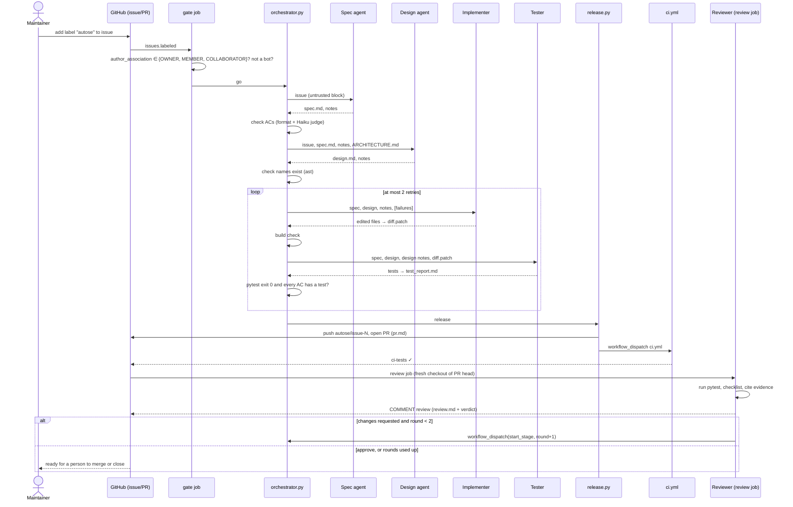

# Sequence view

> **Status: PLANNED.** This will be replaced with one real run (with links) once the workflow runs.

```mermaid
sequenceDiagram
    actor M as Maintainer
    participant GH as GitHub (issue/PR)
    participant G as gate job
    participant O as orchestrator.py
    participant S as Spec agent
    participant D as Design agent
    participant I as Implementer
    participant T as Tester
    participant R as release.py
    participant CI as ci.yml
    participant RV as Reviewer (review job)

    M->>GH: add label "autose" to issue #N
    GH->>G: issues.labeled
    G->>G: author_association ∈ {OWNER, MEMBER, COLLABORATOR}? not a bot?
    G->>O: go
    O->>S: issue (untrusted block)
    S-->>O: spec.md, notes
    O->>O: check ACs (format + Haiku judge)
    O->>D: issue, spec.md, notes, ARCHITECTURE.md
    D-->>O: design.md, notes
    O->>O: check names exist (ast)
    loop at most 2 retries
        O->>I: spec, design, notes, [failures]
        I-->>O: edited files → diff.patch
        O->>O: build check
        O->>T: spec, design, design notes, diff.patch
        T-->>O: tests → test_report.md
        O->>O: pytest exit 0 and every AC has a test?
    end
    O->>R: release
    R->>GH: push autose/issue-N, open PR (pr.md)
    R->>CI: workflow_dispatch ci.yml
    CI-->>GH: ci-tests ✓
    GH->>RV: review job (fresh checkout of PR head)
    RV->>RV: run pytest, checklist, cite evidence
    RV-->>GH: COMMENT review (review.md + verdict)
    alt changes requested and round < 2
        RV->>O: workflow_dispatch(start_stage, round+1)
    else approve, or rounds used up
        GH-->>M: ready for a person to merge or close
    end
```
